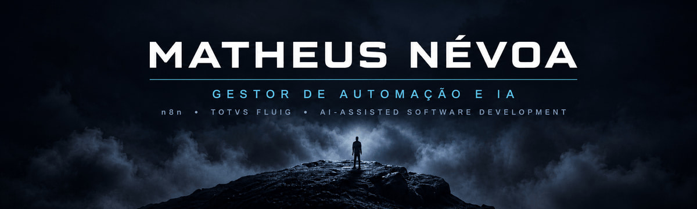

  

  
  
  
  

  <strong>Automação de processos • Inteligência artificial • Sistemas corporativos</strong>

---

## 👋 Sobre mim

Sou **Matheus Névoa**, Analista e Desenvolvedor de Sistemas com mais de **5 anos de experiência** transformando necessidades de negócio em soluções digitais.

Hoje, minha atuação conecta três áreas que sempre caminharam juntas na minha trajetória: **processos, tecnologia e pessoas**. Trabalho com automação e inteligência artificial na **Tech Leads Club**, conduzo projetos corporativos como **Analista e Desenvolvedor Fluig Sênior e Gestor de Automação e IA na Future Station** e desenvolvo a **NévoaIA**, minha iniciativa pessoal voltada à criação de soluções inteligentes para empresas.

Gosto de entender o problema antes de escolher a tecnologia. A partir disso, desenho o fluxo, construo a solução, testo, documento e acompanho sua evolução em produção.

> **Meu objetivo é simples:** tirar processos do manual e transformá-los em sistemas confiáveis, escaláveis e capazes de gerar impacto mensurável.

---

## ⚡ Onde atuo hoje

<table>
  <tr>
    <td width="50%" valign="top">
      <h3>💎 Tech Leads Club</h3>
      <strong>Gestor de Automação e IA</strong>
        
      Estruturo e desenvolvo os sistemas de automação que sustentam operações de <strong>marketing, vendas e receita</strong>. Conecto n8n, CRM, formulários, e-mail, WhatsApp, dados e IA para transformar rotinas manuais em operações mais eficientes e confiáveis.
    </td>
    <td width="50%" valign="top">
      <h3>🚀 Future Station</h3>
      <strong>Analista e Desenvolvedor Fluig Sênior & Gestor de Automação e IA</strong>
        
      Conduzo projetos corporativos de ponta a ponta com <strong>TOTVS Fluig, automação e inteligência artificial</strong>. Atuo também em um ambiente Fluig de grande escala, com mais de <strong>25 mil usuários</strong>.
    </td>
  </tr>
</table>

<table>
  <tr>
    <td width="100%" valign="top">
      <h3>🌫️ NévoaIA</h3>
      <strong>Automação, IA e desenvolvimento de software</strong>
        
      Minha iniciativa pessoal e espaço de experimentação prática, onde desenvolvo automações, agentes de IA, integrações e produtos digitais. A proposta é conectar dados, sistemas e decisões para tornar as operações das empresas mais simples e inteligentes.
    </td>
  </tr>
</table>

---

## 🧭 Minha trajetória

Minha base profissional foi construída ao longo de mais de **cinco anos na TOTVS**, atuando com implantação, administração, suporte, desenvolvimento e evolução de ambientes **TOTVS Fluig**.

Essa experiência me deu uma visão completa do ciclo de uma solução corporativa: entender a operação, conversar com usuários, analisar incidentes, desenvolver melhorias, integrar sistemas e manter tudo funcionando em produção.

Hoje, levo essa bagagem para um novo momento da minha carreira, unindo **automação com n8n, inteligência artificial e desenvolvimento assistido por IA** à experiência que construí com processos e sistemas corporativos.

---

## 🛠️ O que eu construo

<table>
  <tr>
    <td width="50%" valign="top">
      <h3>⚙️ Automações em produção</h3>
      Fluxos com n8n, APIs e webhooks, preparados com validações, logs, alertas, tratamento de erros e mecanismos de recuperação.
    </td>
    <td width="50%" valign="top">
      <h3>🤖 Sistemas com IA</h3>
      Agentes, LLMs e soluções inteligentes aplicadas a processos reais, com foco em produtividade, análise e apoio à tomada de decisão.
    </td>
  </tr>
  <tr>
    <td width="50%" valign="top">
      <h3>🔷 Ecossistema TOTVS Fluig</h3>
      Processos BPM, formulários, datasets, widgets, portais, GED, Identity, integrações, administração e sustentação da plataforma.
    </td>
    <td width="50%" valign="top">
      <h3>🧩 Produtos e integrações</h3>
      Dashboards, ferramentas internas, pipelines de dados e conexões entre CRMs, bancos de dados e sistemas corporativos.
    </td>
  </tr>
</table>

---

## 💻 Tecnologias

  
  &nbsp;&nbsp;
  
  &nbsp;&nbsp;
  
  &nbsp;&nbsp;
  
  &nbsp;&nbsp;
  
  &nbsp;&nbsp;
  
  &nbsp;&nbsp;
  
  &nbsp;&nbsp;
  
  &nbsp;&nbsp;
  
  &nbsp;&nbsp;
  
  &nbsp;&nbsp;
  

  
  
  
  
  

---

## 📚 Em constante evolução

Tenho mais de **15 certificações em TOTVS Fluig e tecnologias web** e curso **Análise e Desenvolvimento de Sistemas na Descomplica**.

Atualmente, aprofundo meus estudos em **LLMs, engenharia de prompt, agentes de IA, Python, LangChain, LangGraph, arquitetura de software e desenvolvimento orientado por especificações**.

 

  <strong>Vamos transformar um processo complexo em uma solução simples?</strong>

  
  

  Construindo soluções entre processos, automação e inteligência artificial.

